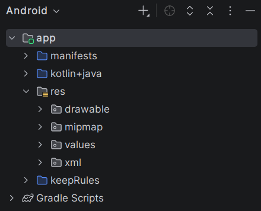

# Estructura del Proyecto Android

Hemos creado un proyecto Android en Android Studio, y ahora es importante entender la estructura de carpetas y archivos que componen nuestro proyecto. A continuación, se describen las principales carpetas y archivos que encontrarás en tu proyecto Android.

Cuando abrimos un proyecto Android en Android Studio, veremos una estructura de carpetas y archivos que puede parecer compleja al principio. Sin embargo, cada carpeta y archivo tiene un propósito específico en el desarrollo de nuestra aplicación.

## Carpetas principales

Veamos algunas de las carpetas más importantes que encontraremos en nuestro proyecto Android:

* `app`: Esta carpeta contiene todo el código fuente y los recursos de nuestra aplicación. Dentro de esta carpeta, encontraremos subcarpetas como `kotlin+java`, `res` y `manifests`.
* `kotlin+java`: Dentro de esta carpeta, encontraremos el código fuente de nuestra aplicación. Aquí es donde escribiremos nuestro código Kotlin y donde se encuentran los archivos de actividad y fragmentos. Puedes encontrar código de ejemplo en la carpeta `kotlin` y código Java en la carpeta `java`.
* `res`: Esta carpeta contiene los recursos de nuestra aplicación, como imágenes, archivos de diseño XML, cadenas de texto y estilos. Dentro de la carpeta `res`, encontraremos subcarpetas como `drawable`, `layout`, `values` y otras.
* `manifests`: Esta carpeta contiene el archivo `AndroidManifest.xml`, que es un archivo de configuración importante para nuestra aplicación. Aquí es donde declaramos las actividades, servicios y permisos que nuestra aplicación necesita.

!!! nota
    En caso de no ver la estructura de carpetas mencionada, asegúrate de estar en la vista "Android" en el panel de proyecto de Android Studio. Puedes cambiar la vista haciendo clic en el menú desplegable en la parte superior del panel de proyecto y seleccionando "Android".

Vamos a ver más en detalle cada una de estas carpetas y archivos para entender mejor su función en el desarrollo de nuestra aplicación Android.

<figure>
  
  <figcaption>Estructura del Proyecto Android</figcaption>
</figure>

## Código Fuente

La carpeta `kotlin+java` contiene el código fuente de nuestra aplicación. Aquí es donde escribiremos nuestro código Kotlin y donde se encuentran los archivos de actividad y fragmentos. Puedes encontrar código de ejemplo en la carpeta `kotlin` y código Java en la carpeta `java`.

Puedes ver que dentro hay varias carpetas que representan los paquetes de nuestra aplicación. Cada paquete puede contener varias clases y archivos de código fuente.

Veras que hay un archivo llamado `MainActivity.kt`. Este archivo es la actividad principal de nuestra aplicación y es donde escribiremos el código para mostrar el mensaje en la pantalla.

Es importante mencionar que el código fuente de nuestra aplicación se organiza en paquetes, lo que nos permite mantener nuestro código organizado y modular. Cada paquete puede contener varias clases y archivos de código fuente.

No hay una regla estricta sobre cómo organizar los paquetes, pero es recomendable seguir una convención de nombres que refleje la funcionalidad de cada paquete. Por ejemplo, podemos tener un paquete llamado `ui` para las clases relacionadas con la interfaz de usuario, otro llamado `data` para las clases relacionadas con el manejo de datos, y así sucesivamente.

Durante este curso, veremos diferentes formas de organizar nuestro código fuente y cómo crear paquetes y clases para mantener nuestro proyecto limpio y fácil de mantener.

### Tests

Habrás visto que hay 2 paquetes llamados `test` y `androidTest`. Estos paquetes se utilizan para escribir pruebas unitarias y pruebas de instrumentación, respectivamente. Las pruebas unitarias se ejecutan en la JVM y se utilizan para probar la lógica de nuestra aplicación, mientras que las pruebas de instrumentación se ejecutan en un dispositivo o emulador Android y se utilizan para probar la interfaz de usuario y la interacción con el sistema.

Más adelante veremos como escribir pruebas unitarias y de instrumentación para nuestra aplicación Android, y cómo ejecutar estas pruebas desde Android Studio.

## Recursos (Res)

Uno de los apartados más importantes de nuestra aplicación son los recursos. Los recursos son archivos que no forman parte del código fuente, pero que son necesarios para el funcionamiento de nuestra aplicación. Estos recursos pueden ser imágenes, archivos de diseño XML, cadenas de texto, estilos y otros.

En Android, los recursos se organizan en la carpeta `res`, que contiene varias subcarpetas para diferentes tipos de recursos. Algunas de las subcarpetas más importantes son:

* `drawable`: Esta carpeta contiene imágenes y gráficos que se utilizan en nuestra aplicación. Podemos colocar imágenes en diferentes resoluciones para adaptarse a diferentes tamaños de pantalla y densidades de píxeles.
* `layout`: Esta carpeta contiene archivos de diseño XML que definen la estructura y apariencia de nuestras pantallas. Cada archivo de diseño representa una pantalla o un componente de nuestra aplicación.
* `values`: Esta carpeta contiene archivos XML que definen valores como cadenas de texto, colores y estilos. Por ejemplo, podemos definir nuestras cadenas de texto en un archivo llamado `strings.xml`, y luego referenciarlas en nuestro código fuente o archivos de diseño.


Cada uno de estos recursos se puede referenciar en nuestro código fuente utilizando un identificador único generado por Android Studio. Por ejemplo, si tenemos una cadena de texto llamada `app_name` en nuestro archivo `strings.xml`, podemos referenciarla en nuestro código fuente utilizando `R.string.app_name`.

!!! info
    Más adelante veremos cómo crear y utilizar recursos en nuestra aplicación Android, y cómo organizarlos de manera efectiva para mantener nuestro proyecto limpio y fácil de mantener.

## Android Manifest

Por último, tenemos el archivo `AndroidManifest.xml`, que se encuentra en la carpeta `manifests`. Este archivo es un archivo de configuración importante para nuestra aplicación, ya que define la estructura y el comportamiento de nuestra aplicación.

En el archivo `AndroidManifest.xml`, podemos declarar las actividades, servicios y permisos que nuestra aplicación necesita. Por ejemplo, podemos declarar la actividad principal de nuestra aplicación, así como los permisos necesarios para acceder a la cámara o al almacenamiento del dispositivo.

Un ejemplo de cómo se ve el archivo `AndroidManifest.xml` es el siguiente:

```xml
<manifest xmlns:android="http://schemas.android.com/apk/res/android"
    package="com.example.myapp">
    <application
        android:allowBackup="true"
        android:icon="@mipmap/ic_launcher"
        android:label="@string/app_name"
        android:roundIcon="@mipmap/ic_launcher_round"
        android:supportsRtl="true"
        android:theme="@style/Theme.MyApp">
        <activity
            android:name=".MainActivity"
            android:exported="true">
            <intent-filter>
                <action android:name="android.intent.action.MAIN" />
                <category android:name="android.intent.category.LAUNCHER" />
            </intent-filter>
        </activity>
    </application>
</manifest>
```

En este ejemplo, podemos ver que hemos declarado la actividad principal de nuestra aplicación (`MainActivity`) y hemos definido un filtro de intención para que esta actividad se inicie cuando el usuario abra nuestra aplicación.

Podemos ver varias referencias a recursos en el archivo `AndroidManifest.xml`, como `@mipmap/ic_launcher` y `@string/app_name`. Estas referencias nos permiten utilizar recursos definidos en nuestra carpeta `res` en nuestro archivo de manifiesto.