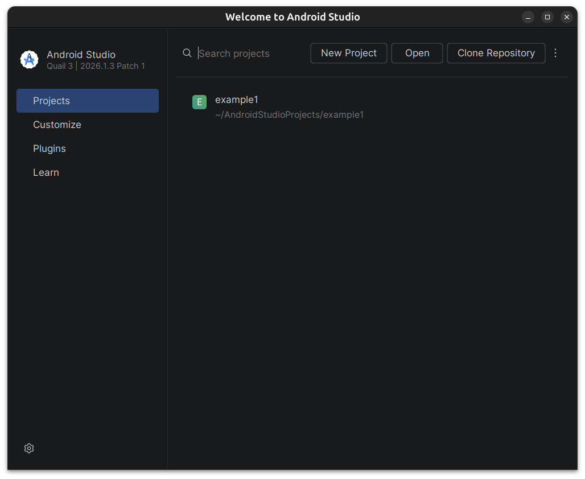
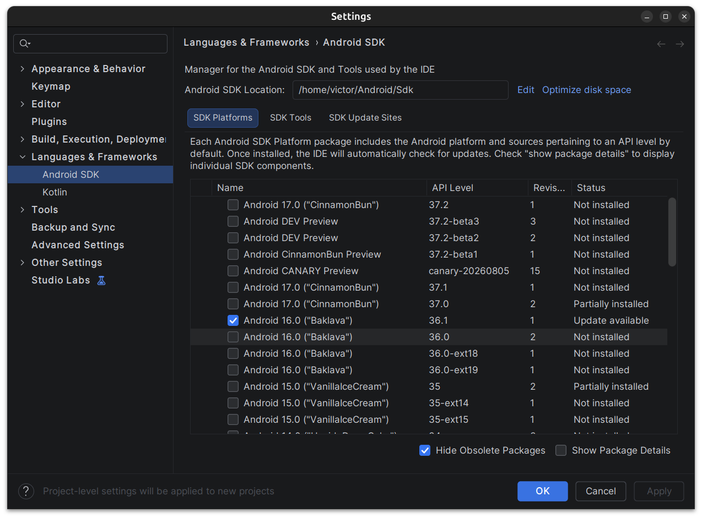
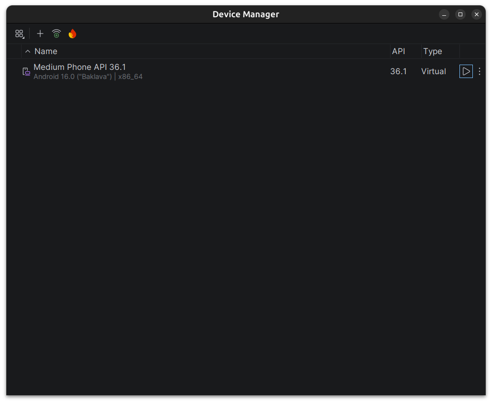
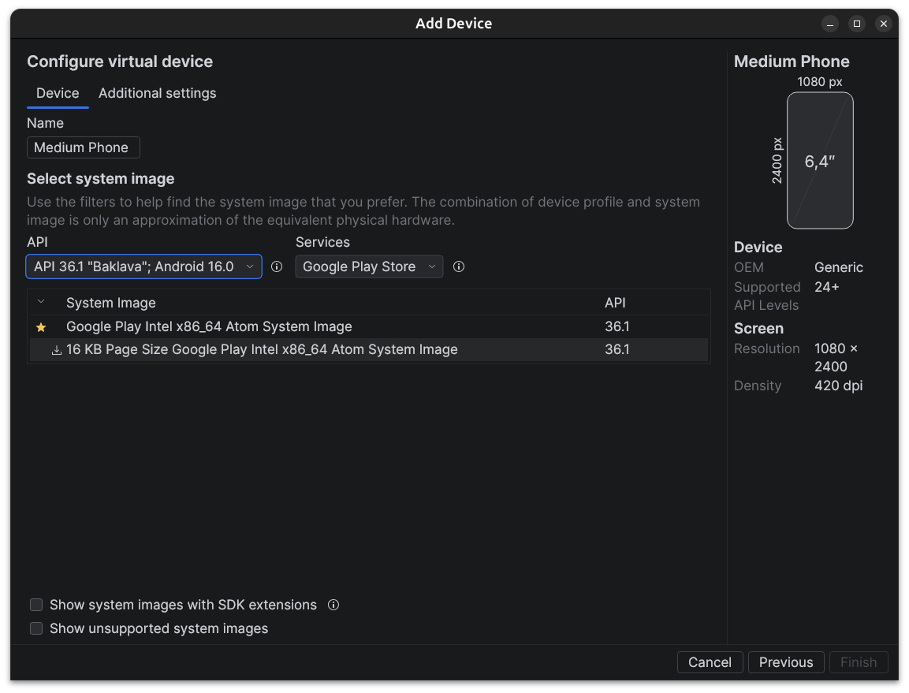
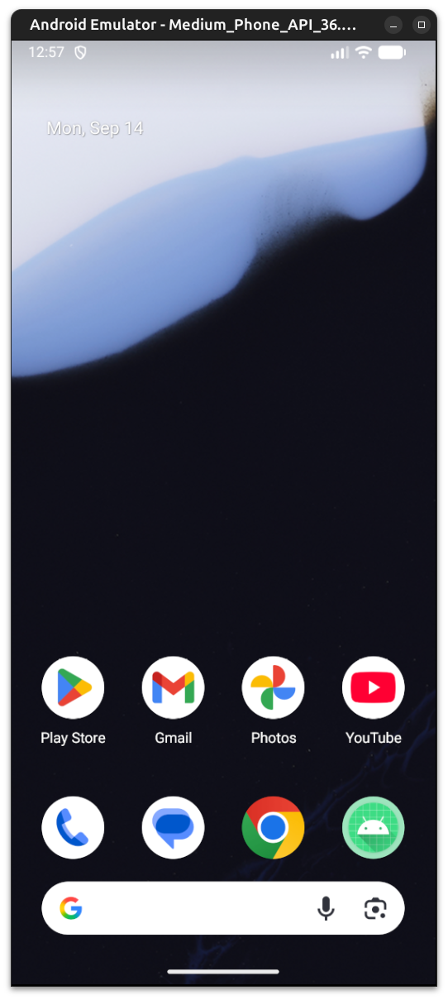
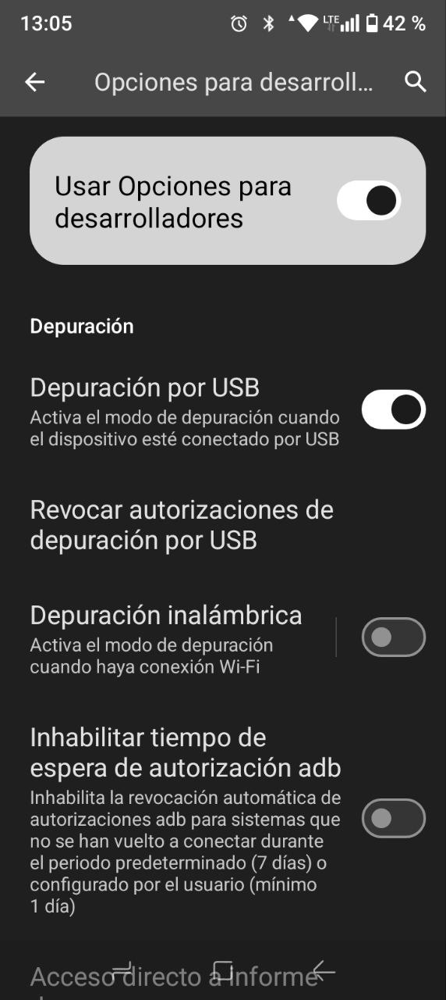

# Instalación del Entorno de Desarrollo

Vamos a comenzar con la instalación del entorno de desarrollo necesario para programar aplicaciones Android. Esto incluye la instalación de Android Studio, el SDK de Android y la configuración de emuladores o dispositivos físicos para probar nuestras aplicaciones.

Es importante que tengamos todas las herramientas correctamente instaladas y configuradas antes de comenzar a desarrollar nuestras aplicaciones Android. Necesitaremos las siguientes herramientas:

* **Android Studio**: Es el entorno de desarrollo integrado (IDE) oficial para el desarrollo de aplicaciones Android. Incluye todas las herramientas necesarias para crear, probar y depurar aplicaciones Android.
* **Android SDK**: Es un conjunto de herramientas y bibliotecas necesarias para desarrollar aplicaciones Android. Incluye el compilador, las herramientas de depuración y las bibliotecas de soporte.
* **Herramientas de Línea de Comandos**: Son herramientas que nos permiten interactuar con el SDK de Android desde la línea de comandos. Esto incluye herramientas como `adb` (Android Debug Bridge) y `fastboot`.
* **Emuladores y Dispositivos Físicos**: Para probar nuestras aplicaciones, podemos utilizar emuladores que simulan dispositivos Android en nuestro ordenador, o podemos conectar dispositivos físicos a nuestro ordenador para probar nuestras aplicaciones directamente en ellos.

Como opcional podemos utilizar **scrcpy**, una herramienta que nos permite controlar y mostrar la pantalla de un dispositivo Android conectado a nuestro ordenador. Esto puede ser útil para depurar y probar nuestras aplicaciones en un dispositivo físico.

!!! warning
    Todos los pasos que vamos a seguir estan basados en la documentación oficial de Android y pueden variar dependiendo del sistema operativo que estemos utilizando (Windows, macOS o Linux). Asegúrate de seguir las instrucciones específicas para tu sistema operativo. Además, nos vasamos en la versión más reciente de Android Studio y el SDK de Android, por lo que es posible que algunas capturas de pantalla o instrucciones puedan diferir ligeramente de lo que veas en tu ordenador.

## Instalación de Android Studio

Android Studio es el entorno de desarrollo oficial para Android y es necesario para crear aplicaciones Android. A continuación, se detallan los pasos para instalar Android Studio en diferentes sistemas operativos. Esta basado en el IDE (Entorno de Desarrollo Integrado) IntelliJ IDEA, por lo que si ya estás familiarizado con este IDE, te resultará más fácil adaptarte a Android Studio.

Este tutorial se basa en la versión más reciente de Android Studio, por lo que es posible que algunas capturas de pantalla o instrucciones puedan diferir ligeramente de lo que veas en tu ordenador. Asegúrate de seguir las instrucciones específicas para tu sistema operativo.

Para utilizar Android Studio necesitamos tener instalado Java Development Kit (JDK) en nuestro ordenador. Asegúrate de tener la versión correcta de JDK instalada antes de continuar con la instalación de Android Studio.

Para instalar Android Studio, sigue los siguientes pasos:

1. Descarga el instalador de Android Studio desde la página oficial: [https://developer.android.com/studio](https://developer.android.com/studio).
2. Ejecuta el instalador y sigue las instrucciones en pantalla para completar la instalación.
3. Una vez instalado, abre Android Studio y sigue las instrucciones para configurar el entorno de desarrollo, incluyendo la instalación del SDK de Android y la configuración de emuladores o dispositivos físicos.

!!! note
    Si descargas la versión en zip o tar.gz de Android Studio, asegúrate de descomprimirla en una ubicación adecuada y ejecutar el archivo `studio.sh` (Linux) o `studio.exe` (Windows) para iniciar Android Studio.

<figure>
  
  <figcaption>Inicio de Android Studio</figcaption>
</figure>

Una vez instalado, vamos a configurar el entorno de desarrollo para Android, incluyendo la instalación del SDK de Android y la configuración de emuladores o dispositivos físicos para probar nuestras aplicaciones.

## Instalación de Android SDK y Herramientas de Línea de Comandos

Vamos a instalar el SDK de Android y las herramientas de línea de comandos necesarias para desarrollar aplicaciones Android. Esto incluye la instalación de `adb` (Android Debug Bridge) y `fastboot`, que nos permiten interactuar con dispositivos Android desde la línea de comandos.

Este conjunto de herramientas es importante para poder compilar, ejecutar y depurar nuestras aplicaciones Android. A continuación, se detallan los pasos para instalar el SDK de Android y las herramientas de línea de comandos.

Para poder instalar todas estas herramientas, necesitaremos utilizar el SDK Manager de Android Studio, que nos permite descargar e instalar las diferentes versiones del SDK de Android y las herramientas necesarias para desarrollar aplicaciones Android.

<figure>
  
  <figcaption>SDK Manager de Android Studio</figcaption>
</figure>

Para acceder al SDK Manager, abre Android Studio y pulsa el menú de tres puntos a la derecha de la barra de herramientas y selecciona "SDK Manager". Desde aquí, podemos descargar e instalar las diferentes versiones del SDK de Android y las herramientas necesarias para desarrollar aplicaciones Android.

Podemos encontrar 3 pestañas:

* **SDK Platforms**: Desde aquí podemos seleccionar las diferentes versiones del SDK de Android que queremos instalar. Asegúrate de seleccionar la versión más reciente del SDK de Android y cualquier otra versión que necesites para tu proyecto.
*  **SDK Tools**: Desde aquí podemos seleccionar las herramientas de línea de comandos que queremos instalar, incluyendo `adb` y `fastboot`. Asegúrate de seleccionar las herramientas necesarias para tu proyecto.
* **SDK Update Sites**: Desde aquí podemos agregar o eliminar sitios de actualización del SDK de Android. Esto nos permite descargar e instalar nuevas versiones del SDK de Android y las herramientas necesarias para desarrollar aplicaciones Android.

En nuestro caso vamos a instalar las siguientes herramientas:

* **Android SDK Platform-Tools**: Incluye `adb` y `fastboot`, que nos permiten interactuar con dispositivos Android desde la línea de comandos.
* **Android SDK Build-Tools**: Incluye las herramientas necesarias para compilar y construir nuestras aplicaciones Android.
* **Android Emulator**: Incluye el emulador de Android, que nos permite ejecutar nuestras aplicaciones en un dispositivo virtual en nuestro ordenador.
* **Android SDK 16+**: Incluye las bibliotecas necesarias para desarrollar aplicaciones Android para diferentes versiones del sistema operativo Android.

!!! warning
    Asegúrate de seleccionar la versión más reciente del SDK de Android y cualquier otra versión que necesites para tu proyecto. Además, asegúrate de seleccionar las herramientas necesarias para tu proyecto, incluyendo `adb`, `fastboot` y el emulador de Android.

También podemos instalar otras herramientas opcionales, como `NDK` (Native Development Kit) si necesitamos desarrollar aplicaciones Android que utilicen código nativo en C o C++. Sin embargo, para la mayoría de los proyectos de desarrollo de aplicaciones Android, no es necesario instalar `NDK` o también `CMake` y `LLDB` (herramientas de depuración para código nativo). Asegúrate de seleccionar solo las herramientas necesarias para tu proyecto.

Una vez seleccionadas las herramientas necesarias, pulsa el botón "Apply" para descargar e instalar las herramientas seleccionadas. Esto puede tardar varios minutos dependiendo de la velocidad de tu conexión a Internet y del tamaño de las herramientas seleccionadas.

### Android API

Podrás observar que existen un gran número de versiones de Android API disponibles para instalar. Cada versión de Android API corresponde a una versión específica del sistema operativo Android. Por ejemplo, Android API 30 corresponde a Android 11, mientras que Android API 31 corresponde a Android 12.

Asegurate de instalar la versión más reciente y comprobar la compatibilidad de tu aplicación con las versiones de Android que deseas soportar. Para la mayoría de los proyectos, es recomendable instalar al menos la versión más reciente del SDK de Android y cualquier otra versión que necesites para tu proyecto.

!!! warning
    Si vas a utilizar tu dispositivo físico para probar tus aplicaciones, asegúrate de que tu dispositivo esté actualizado a la versión más reciente del sistema operativo Android y que sea compatible con la versión del SDK de Android que estás utilizando. Puedes ver la versión de Android de tu dispositivo en "Ajustes" > "Acerca del teléfono" > "Versión de Android".

## Configuración de Emuladores y Dispositivos Físicos

Por último, vamos a configurar emuladores y dispositivos físicos para probar nuestras aplicaciones Android. Esto nos permitirá ejecutar nuestras aplicaciones en un entorno controlado y depurarlas antes de lanzarlas al público.

Es importante mencionar que los emuladores son una herramienta muy útil para probar nuestras aplicaciones, pero no siempre reflejan el comportamiento de un dispositivo físico. Por lo tanto, es recomendable probar nuestras aplicaciones en dispositivos físicos siempre que sea posible.

### Configuración de Emuladores

Vamos a comenzar por configurar emuladores para probar nuestras aplicaciones Android. Los emuladores nos permiten ejecutar nuestras aplicaciones en un dispositivo virtual en nuestro ordenador, lo que nos permite probar nuestras aplicaciones sin necesidad de un dispositivo físico.

!!! warning
    Asegurate de tener suficiente espacio en tu disco duro y memoria RAM disponible para ejecutar emuladores, ya que pueden consumir muchos recursos del sistema.

Para crear un nuevo emulador, ve a "Tools" > "AVD Manager" y haz clic en "Create Virtual Device"; o desde el inicio de Android Studio en el menú de tres puntos a la derecha de la barra de herramientas y selecciona "Virtual Device Manager". Desde aquí, podemos seleccionar el tipo de dispositivo que queremos emular, la versión del sistema operativo Android que queremos utilizar y otras configuraciones del emulador.

<figure>
  
  <figcaption>AVD Manager de Android Studio</figcaption>
</figure>

En la parte superior, podemos añadir un nuevo emulador pulsando el botón "Create Virtual Device". Esto nos permitirá seleccionar el tipo de dispositivo que queremos emular, la versión del sistema operativo Android que queremos utilizar y otras configuraciones del emulador.

Podemos seleccionar varios perfiles de dispositivos, como teléfonos, tabletas, relojes inteligentes y televisores. Asegúrate de seleccionar un perfil de dispositivo que sea compatible con la versión del SDK de Android que estás utilizando.

Una vez hecho esto, podemos seleccionar la versión del sistema operativo Android que queremos utilizar en nuestro emulador. Asegúrate de seleccionar una versión del sistema operativo Android que sea compatible con la versión del SDK de Android que estás utilizando.

<figure>
  
  <figcaption>Creación de un nuevo emulador</figcaption>
</figure>

Una vez creado, podemos iniciarlo pulsando el botón "Play" en la lista de emuladores. Esto iniciará el emulador y nos permitirá ejecutar nuestras aplicaciones en un dispositivo virtual en nuestro ordenador.

<figure>
  
  <figcaption>Emulador Android en ejecución</figcaption>
</figure>

### Configuración de Dispositivos Físicos

Para probar nuestras aplicaciones en un dispositivo físico, necesitamos habilitar la depuración USB en nuestro dispositivo Android y conectarlo a nuestro ordenador mediante un cable USB.

!!! info
    Existe la opción de depurar utilizando una conexión inalámbrica, pero para la mayoría de los proyectos, es recomendable utilizar un cable USB para garantizar una conexión estable y rápida.

Es importante habilitar el modo desarrollador en nuestro dispositivo Android; para ello seguiremos los siguientes pasos:

1. Ve a "Ajustes" > "Acerca del teléfono" y pulsa varias veces sobre "Número de compilación" hasta que aparezca un mensaje indicando que el modo desarrollador está habilitado.
2. Vuelve a "Ajustes" y selecciona "Opciones de desarrollador". Aquí, habilita la opción "Depuración USB".
3. Conecta tu dispositivo Android a tu ordenador mediante un cable USB. Asegúrate de que el dispositivo esté desbloqueado y que la pantalla esté encendida.

Una vez conectado, tu dispositivo debería de mostrarte una notificación indicando que la depuración USB está habilitada. Acepta la solicitud de depuración USB en tu dispositivo para permitir que tu ordenador se conecte a él.

!!! nota
    Es posible que en algunos modelos de dispositivos solo este habilitada la carga por USB y no la transferencia de datos. Asegúrate de que tu dispositivo esté configurado para permitir la transferencia de datos mediante USB.

<figure>
    
    <figcaption>Habilitación de la depuración USB en un dispositivo Android</figcaption>
</figure>