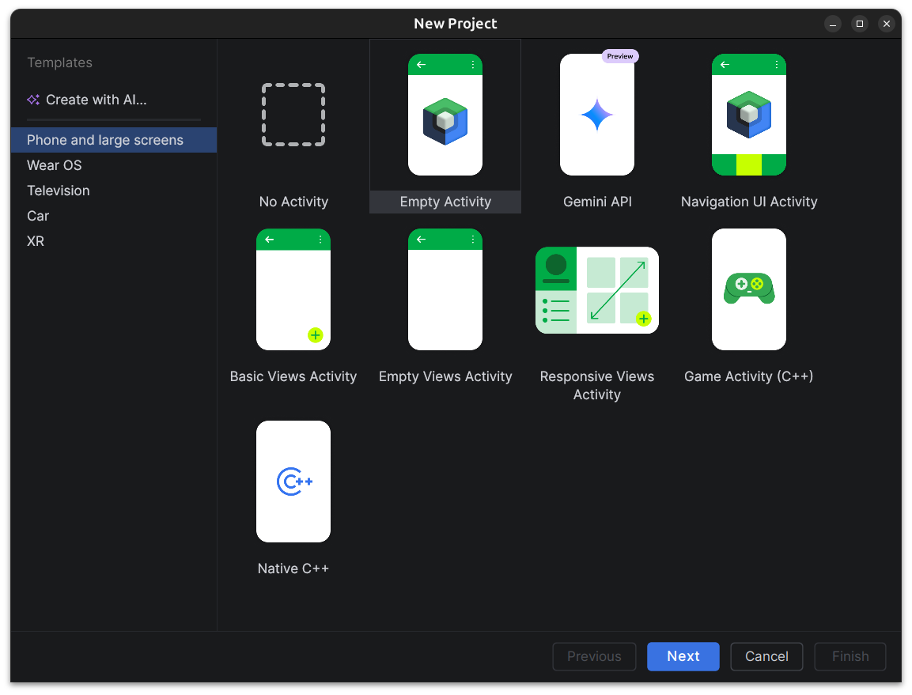
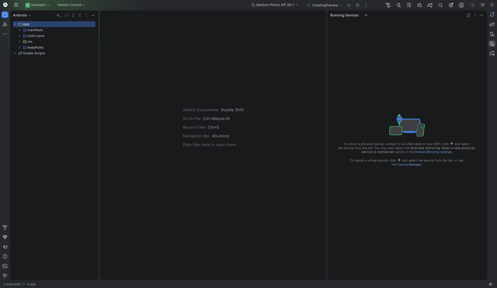

# Primera Aplicación Android

Tras haber instalado Android Studio y configurado el entorno de desarrollo, es hora de crear nuestra primera aplicación Android. A continuación, se detallan los pasos para lograrlo.

Vamos a crear una aplicación simple que muestre un mensaje en la pantalla. Utilizaremos el lenguaje de programación Kotlin, que es el recomendado para el desarrollo de aplicaciones Android.

!!! info
    En el tema 2, nos centraremos en la sintaxis de Kotlin y en cómo crear una aplicación Android desde cero. Asegúrate de seguir los pasos cuidadosamente para obtener los mejores resultados.

Recuerda que debes tener Android Studio instalado y configurado correctamente antes de comenzar. Si aún no lo has hecho, revisa la sección de instalación y configuración.

Para crear una aplicación Android, sigue estos pasos:

1. Abre Android Studio y selecciona "New Project".
2. Elige "Empty Activity" y haz clic en "Next".
3. Ingresa el nombre de tu aplicación, por ejemplo, "MiPrimeraApp".
4. Selecciona el lenguaje Kotlin (DLS) y la versión mínima de la API que deseas soportar.
5. Haz clic en "Finish" para crear el proyecto.

!!! info
    La versión mínima de la API no significa que se requiera un dispositivo con esa versión para ejecutar la aplicación. Es simplemente la versión mínima que tu aplicación soportará. Asegúrate de elegir una versión que sea compatible con la mayoría de los dispositivos que deseas alcanzar.

<figure>
  
  <figcaption>Nuevo Proyecto</figcaption>
</figure>

## Interfaz Android Studio

Una vez creado el proyecto, verás la interfaz de Android Studio. Familiarízate con las diferentes secciones, como el editor de código, el panel de diseño y la ventana de herramientas.

En la parte izquierda, encontrarás el panel de proyecto donde se muestran los archivos y carpetas de tu aplicación. En la parte central, está el editor de código donde escribirás tu código Kotlin. A la derecha, encontrarás el panel de diseño que te permite ver cómo se verá tu aplicación en un dispositivo, o incluso en un emulador.

<figure>
  
  <figcaption>Interfaz de Android Studio</figcaption>
</figure>

